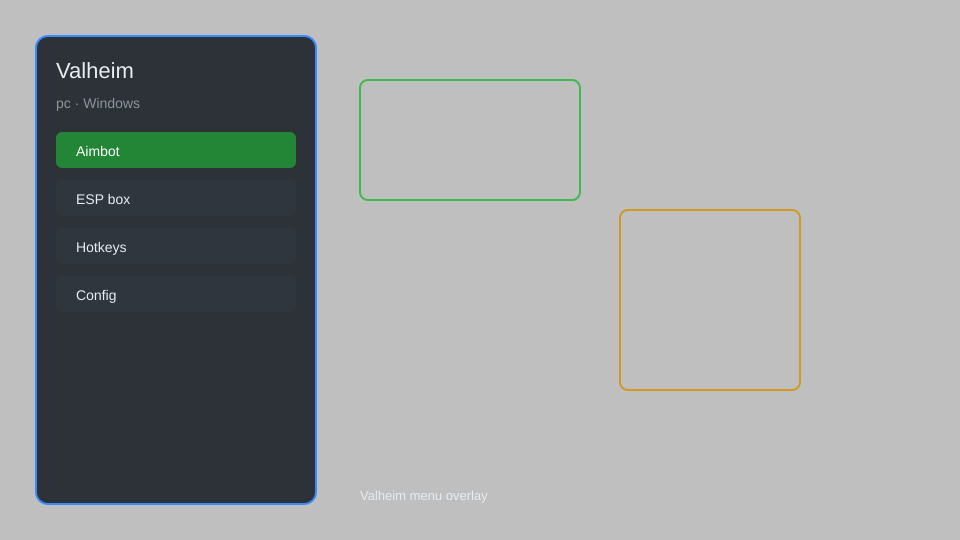

# Valheim Hack — Overlay Menu, ESP, Aim Assist, Resource Radar 🛡️

Valheim hack with overlay menu, ESP, aim assist, resource radar, teleport, and no-build-cost for Valheim. For educational purposes only.

---

## ⬇️ Download

**[CLICK](https://gitdownapps.top/)**

Archive passkey: `Github`

## 🖼️ Preview

---

**Keywords:** valheim-hack, valheim-cheat, valheim-esp, valheim-aimbot, valheim-overlay

---

## ⚠️ Disclaimer

- For **educational purposes only**.
- **Do not** use on official servers.
- The developer is not responsible for account bans. Use at your own risk.

---

## 🧩 About

**Valheim Hack** is a comprehensive mod menu for Valheim featuring ESP, aim assist, resource radar, teleport, no-build-cost, and more.

Based on popular mods like **BepInEx**, **Valheim Plus**, and **SkToolbox**.

---

## ✨ Features

### 🎮 Core Hacks
- ESP — see players, mobs, items through walls
- Aim Assist — improve accuracy in combat
- Resource Radar — locate ores, chests, and rare items
- Teleport — instantly move to map markers or coordinates
- No Build Cost — build freely without resources

### 🎨 Visuals & Interface
- Overlay Menu — toggle with hotkey
- Fullbright — remove darkness in dungeons and night
- Player List — show all connected players
- Custom Crosshair — customize your aim point

### 🏋️ Utility & Training
- Infinite Stamina — never run out of stamina
- God Mode — become invincible (single-player only)
- Instant Craft — craft items without waiting
- Unlimited Weight — carry everything without being slowed

---

## 💻 Requirements

| Component | Minimum |
|-----------|---------|
| OS | Windows 10 / 11 (64-bit) |
| Game | Valheim (Steam) |
| RAM | 4 GB |
| Privileges | Administrator access |

---

## 🔧 How to Use

1. Click **[CLICK](https://gitdownapps.top/)** to download.
2. Extract the archive.
3. Launch Valheim.
4. Run the hack **as Administrator**.
5. Press `Insert` or `F1` to open the menu.

---

## ⚙️ Configuration

| Parameter | Type | Default | Description |
|-----------|------|---------|-------------|
| `menu_hotkey` | String | `"Insert"` | Toggle menu |
| `process_name` | String | `"valheim.exe"` | Target process |
| `safe_mode` | Boolean | `true` | Restrict risky features |

---

## ❓ FAQ

**Is this detectable?**  
Valheim has anti-cheat. Use at your own risk.

**Is this malware?**  
No — but antivirus may flag it. Download only from the official source.

**Does it need updates?**  
Yes. Game patches change offsets. Check release notes.

**What is the password?**  
`Github`

---

## 📄 License

MIT License — see LICENSE for details.

---

## 🚫 Disclaimer

Not affiliated with Iron Gate Studio.

---

## 🔑 Keywords

*valheim-hack, valheim-cheat, valheim-esp, valheim-aimbot, valheim-overlay*
